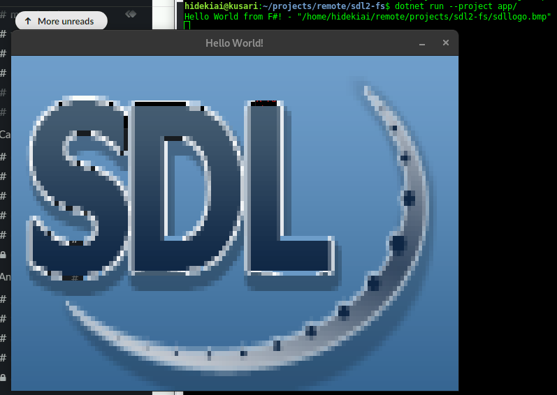

# SDL2 on F#

## Summary
* Using SDL2-CS (SDL2 C#) at https://github.com/flibitijibibo/SDL2-CS (see notes)
* F# init call to SDL2

## Notes
* SDL2-CS is relying on .NET 4 framework, but I don't need it; hence I do `git submodule` and hand-delete their .csproj files and use my own
* SDL2-CS is just a wrapper, I started doing my own dllImport but honestly, I'm purely lazy, so decided to just take SDL2-CS (just the src dir) instead
* Possibly, will contact the maintainer of SDL2-CS and request a pure dotnetcore CSProj file

## Build
1. cd SDL2-CSharp
2. git submodule add https://github.com/flibitijibibo/SDL2-CS
3. cd SDL2-CS
4. rm \*csproj
5. cd ..
6. dotnet build

## Run
$ dotnet run --project app/

